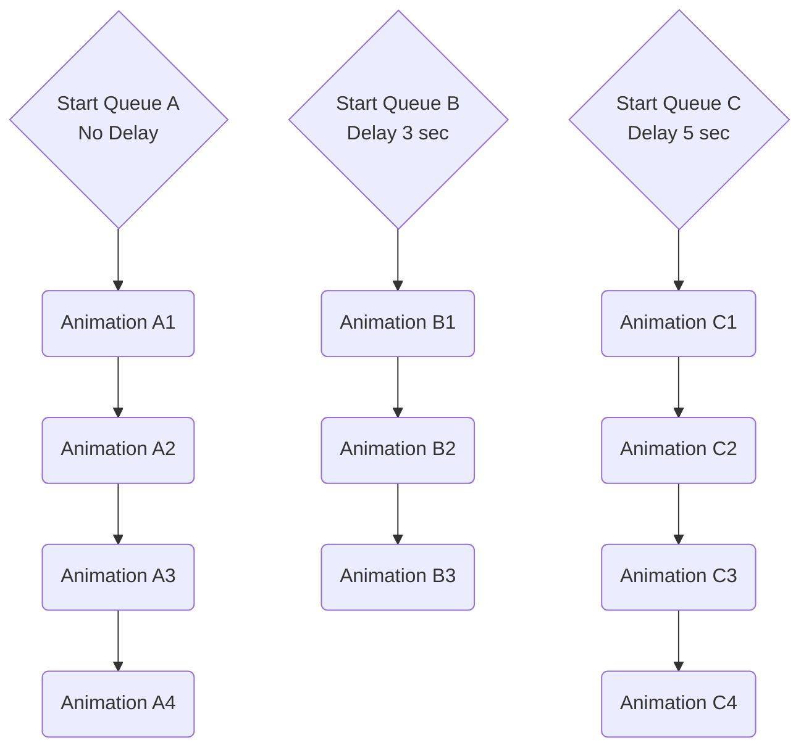

# Flow

A Flow is a set of animations that can be synchronised and threaded together to create more complex animation. They are very useful for scalability as themselves are an animations which means you can have a flow within a flow. A flow can have multiple queues, which will run in parallel and each queue has a set of animations that are played in sequence.

## 1. Options
[!INCLUDE [animation.options](animation.options.md)]
`Loop Count` -  How many loops should this animation have. `[Default: 1]`

## 2. Events
[!INCLUDE [animation.events](animation.events.md)]

## 3. Queues
Each queue will play play a set of animations, in a sequence(one after the other), and all queues will run in parallel. Here's a visual example for this

#### Example
